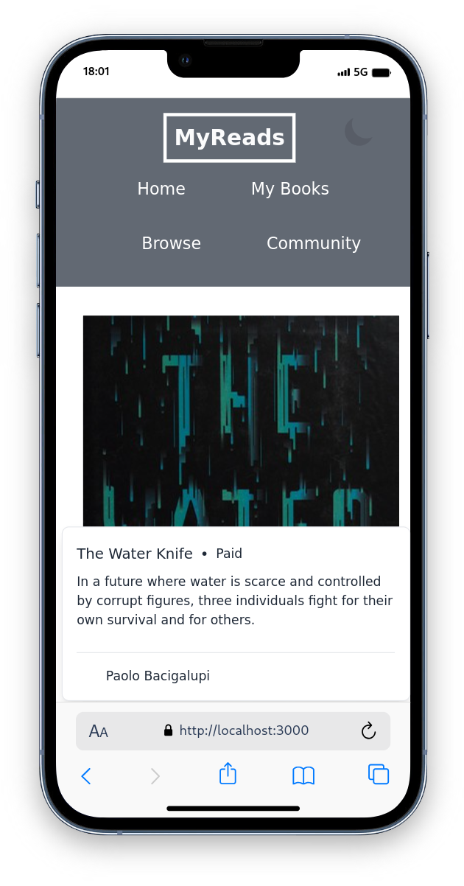
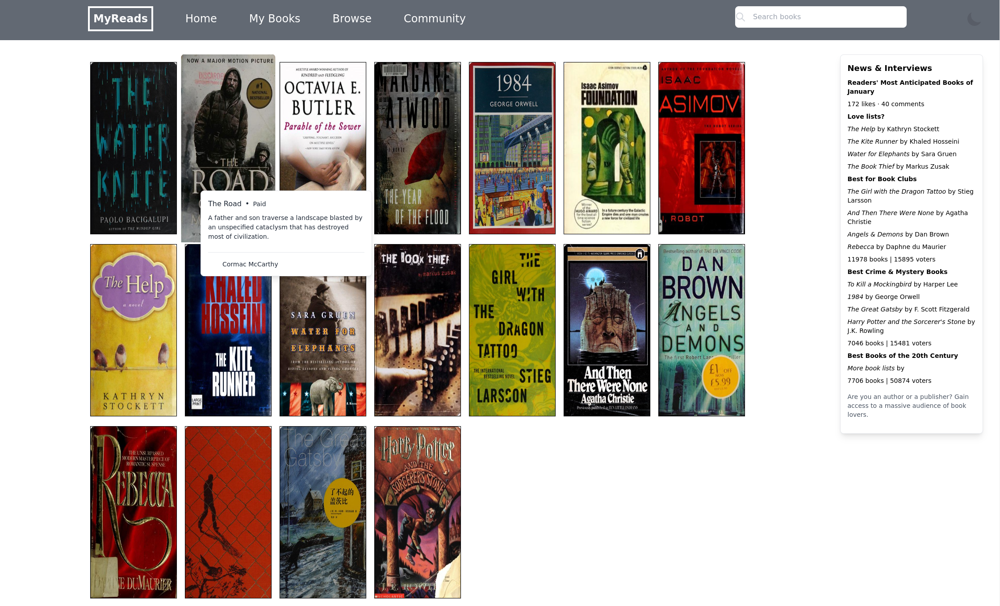

# Interactive E-Library Using Next.js and Tailwind

## Description

This project is an interactive E-library web application built using Next.js and styled with Tailwind. The application allows users to explore and search for books, view additional details of each book, and toggle between different themes.

## Stack

- React
- Next.js
- Tailwind

## Interactive E-Library

<div>
  
  
</div>

## Installation

Install nodejs20 and run the app:
``` sh
yarn dev
```

The app will start on localhost:3000 (by default).

## Goal
I am trying to demonstrate and build upon a small NextJS project and demonstrate an understanding of the following:
- Javascript, including ES6 features like arrow functions and array handling
- React
- Next.js
- Tailwind
